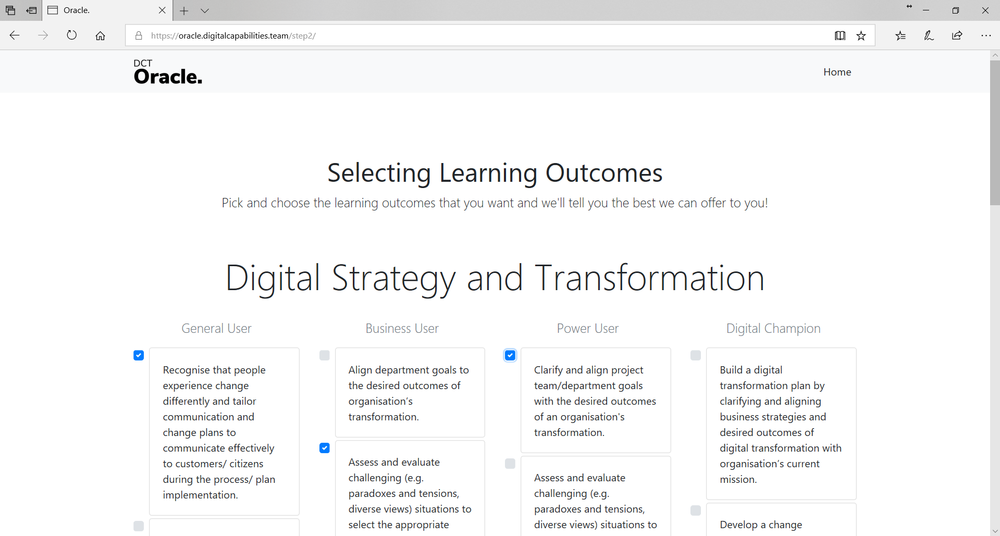
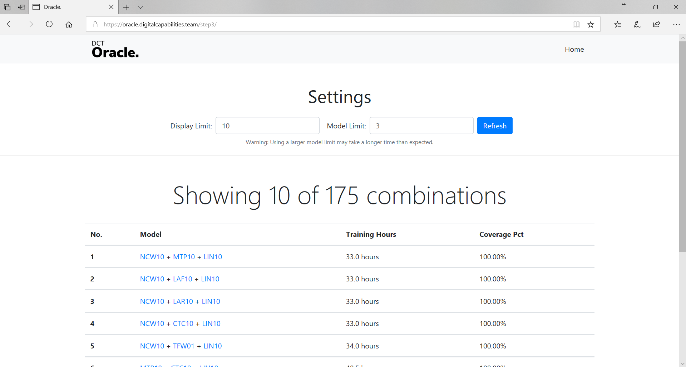
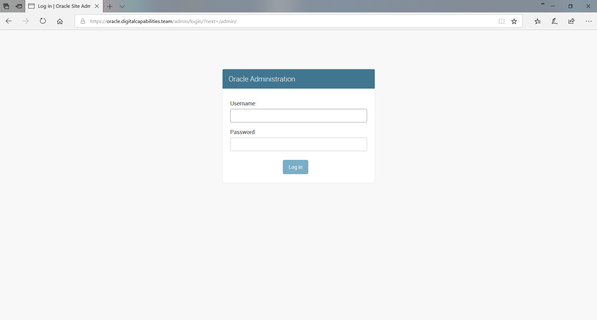
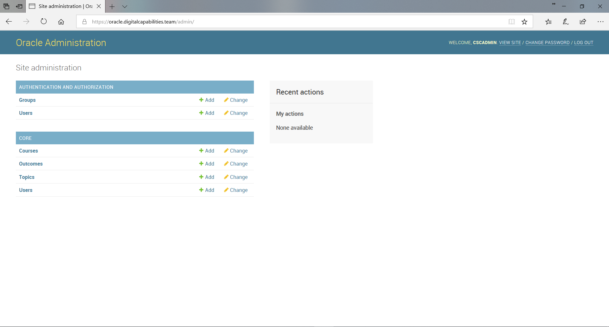

## Table of Contents

- [Methodology](#methodology)
  - [Step 1: Selecting a list of outcomes](#step-1-selecting-a-list-of-outcomes)
  - [Step 2: Determining a list of courses that fulfills selected outcomes](#step-2-determining-a-list-of-courses-that-fulfills-selected-outcomes)
  - [Step 3: Generating a unique set of courses from all associated courses](#step-3-generating-a-unique-set-of-courses-from-all-associated-courses)
  - [Step 4: Creating a powerset combination](#step-4-creating-a-powerset-combination)
  - [Step 5: Determining the best combination](#step-5-determining-the-best-combination)
- [Preparation](#preparation)
  - [Domain Registration](#domain-registration)
  - [Web Hosting](#web-hosting)
  - [Accessing your virtual server via SSH](#accessing-your-virtual-server-via-ssh)
- [Installation](#installation)
  - [Assumptions](#assumptions)
  - [Step 1: Setting up your new server](#step-1-setting-up-your-new-server)
  - [Step 2: Installing database server](#step-2-installing-database-server)
  - [Step 3: Retrieve files using git](#step-3-retrieve-files-using-git)
  - [Step 4: Create a virtualenv of the project](#step-4-create-a-virtualenv-for-the-project)
  - [Step 5: Install required dependencies](#step-5-install-required-dependencies)
  - [Step 6: Initial settings](#step-6-initial-settings)
  - [Step 7: Setup webserver](#step-7-setup-webserver)
  - [Step 8: Go live!](#step-8-go-live)
- [Maintenance](#maintenance)
  - [Accessing the admin portal](#accessing-the-admin-portal)
  - [Editing key information](#editing-key-information)
  - [Editing raw code](#editing-raw-code)


## Methodology
This example merely helps to understand the methodology behind how this works when a user interacts with the site. It includes bit and pieces of information that may not be fully representative of the mechanism behind this.

### Step 1: Selecting a list of outcomes
The initial step of the process would be to have the user select a list of learning outcomes that they are interested to explore.



### Step 2: Determining a list of courses that fulfills selected outcomes
Once the user submits, the backend will determine, based on the relationships that we have previously defined, on what are the courses that are associated with every learning outcome.

| Outcome Code | Course Associations |
| ------------ | ------------------ |
| DSG1         | CSR01, PIP10 |
| DGG6         | CSR01, PIP10, PELP1 |
| UEB1         | MTP10, SDS10 |

### Step 3: Generating a unique set of courses from all associated courses
As seen above, each outcome are associated with a list of courses. However, not all of them are relevant to generate the combinations; we will need to (1) remove duplicates, and (2) remove courses that do not have an upcoming date available. For this example, we assume all courses listed here do have an upcoming date, but those that do not have are removed in reality.

```
all_courses = [CSR01, PIP10, CSR01, PIP10, PELP1, PELP2, MTP10, SDS10, CSR02]
unique_courses = [CSR01, PIP10, PELP1, MTP10, SDS10]
```
### Step 4: Creating a powerset combination
Now that we have a list of 5 courses, there are many many combinations of courses that a user can take. In order to find all of such combinations (NOT permutations), we will use the mathematical concept of [powerset](https://en.wikipedia.org/wiki/Power_set) to generate this outcome. This is done by using the `chain.from_iterable()` class from the Python `itertools` library, which is further explained on [Python docs](https://docs.python.org/3/library/itertools.html#itertools.chain.from_iterable).

```
CSR01
PIP10
PELP1
MTP10
SDS10
CSR01 + PIP10
CSR01 + PELP1
CSR01 + MTP10
CSR01 + SDS10
PIP10 + PELP1
PIP10 + MTP10
PIP10 + SDS10
PELP1 + MTP10
PELP1 + SDS10
MTP10 + SDS10
CSR01 + PIP10 + PELP1
CSR01 + PIP10 + MTP10
CSR01 + PIP10 + SDS10
...
```

### Step 5: Determining the best combination
With every combination available, Python looks up every course in every combination to find out its (1) duration, and (2) degree of coverage. The results of this is rendered in a tabular format shown here:



## Preparation

### Domain Registration

At the very least, this app should have a public domain name for two main reasons:
1. An easy way for users to remember the site URL
2. Ability to use free SSL certs like [Let's Encrypt](https://letsencrypt.org/)

The current domain name `digitalcapabilities.team` is managed through [Namecheap](https://www.namecheap.com/). 

### Web Hosting

Next, the web app needs to sit somewhere but generally I would recommend it to sit on Linux server that is based in Singapore.

The current app is hosted on [DigitalOcean](https://www.digitalocean.com/). They offer Linux Virtual Private Servers (VPS), or Droplets as they call it, at an affordable rate of USD$5/month. 

### Accessing your virtual server via SSH
By default, DigitalOcean allows you to access console via browser, but it is often laggy so SSH is preferred. Assuming you are using Windows, you can download [PuTTY](https://www.putty.org/), [KiTTY](http://www.9bis.net/kitty/), or [MobaXterm](https://mobaxterm.mobatek.net/) to access it. 

##### Connecting using PuTTY Client


_Tip: It is advisable to __ONLY__ open port `22` when you need it and to block the port once you are done accessing it._

## Installation

##### Assumptions
1. Web server, database, app to be installed in a single server
2. Server is based on Debian 9.4
3. You have `root` access, or at least `sudo` access

### Step 1: Setting up your new server

Update all packages to the latest version
```shell
sudo apt-get update && sudo apt-get -y upgrade
```

Run this command to install Python (which should already have been installed) and its package manager `pip`
```shell
sudo apt install -y python3 python3-pip python3-dev
```

### Step 2: Installing database server
By default, Django uses SQLite3 as the database server. However, since we intend to use the Full Text Search function of PostgreSQL, we would need to use this instead.
For the purpose of this tutorial, we will be showing how to setup a PostgreSQL database server on the same host.

##### Installing the required packages
```shell
sudo apt install -y postgresql postgresql-contrib postgresql-doc postgresql-client
```

##### Allow PostgreSQL to be accessed outside of localhost (Optional)

First, we need to locate the directory that your postgresql is stored:
```shell
sudo find / -name postgresql.conf
```
Access the config files for postgresql
```shell
sudo nano /etc/postgresql/9.6/main/postgresql.conf
```
Uncomment the line `#listen_addresses = 'locahost'` and change it to '*'
```shell
listen_addresses = '*'
```

##### Set the appropriate authentication methods

Next, we need to change authentication methods for the users
```shell
sudo nano /etc/postgresql/9.6/main/pg_hba.conf
```

Set the auth method from `peer` to `md5` so local connections require password authentication
```shell
local    all             all                                              md5
```

Allow connections from outside of localhost by changing to `0.0.0.0/0` and `::/0`
```shell
host     all             all              0.0.0.0/0                       md5
host     all             all              ::/0                            md5
```

Restart Postgresql to reflect changes
```shell
sudo service postgresql restart
```

##### Creating users and permissions

We're going to use the default admin account `postgres` to create a new admin account. We are going to use `cscadmin` as the username; you can set the password during the prompt. The first command will create a new user in postgresql, whereas the second command will create a new database with the same name as the user, which is `cscadmin` in this case.
```shell
su - postgres -c 'createuser --interactive --pwprompt'
su - postgres -c 'createdb -O cscadmin cscadmin'
```

_Tip: If you do not have `root` access, use `sudo -u` instead of `su -`._

##### Create database schemas
Lastly, for the purpose of this webapp, we will be confining the database tables under the `oracle` schema.
```shell
sudo psql -U cscadmin -c 'CREATE SCHEMA oracle;'
```

For more information on how to configure a database server like PostgreSQL, visit [this article](https://www.digitalocean.com/community/tutorials/how-to-install-and-use-postgresql-on-ubuntu-18-04) on DigitalOcean would help to give you a brief introduction.

### Step 3: Retrieve files using git

The easiest way to get the files is to have `git` manage the files. You can install `git` with this command:
```shell
sudo apt install -y git
```

In your home directory, create a project folder to house the project. We will be using 'civil-service-college' in this case.
```shell
mkdir civil-service-college
cd civil-service-college
```

Clone the repository by running the following command
```shell
git clone https://github.com/loozhengyuan/oracle.git
```

### Step 4: Create a virtualenv for the project

Next, we will be creating an isolated environment to run this app. This requires a powerful Python library called `virtualenv`. You can install it via `pip`:
```shell
sudo pip3 install virtualenv
```

We will be naming our virtualenv as `venv` and housing it in the project directory
```shell
cd oracle
virtualenv venv
```

Activate the environment
```shell
. venv/bin/activate
```

### Step 5: Install required dependencies

To install the last-known working version of the packages, use the `requirements.txt` to install
```shell
pip install -r requirements.txt
```

(Optional) If you prefer to install the up-to-date version of the packages instead, run this command instead:
```shell
pip install django psycopg2 psycopg2-binary gunicorn
```

### Step 6: Initial settings
Contrary to the default `settings.py` file generated by Django, we made the settings file into a package. 

##### Settings Directory Structure
By the end of this step, your settings directory should appear like this. All files are included, but you would need to create `production.py`.
```
# ~/civil-service-college/oracle/oracle/

settings
├─ __init__.py
├─ base.py
└─ production.py
```

##### Create `production.py`

Navigate to the settings directory, create file and launch it the text editor
```shell
cd ~/civil-service-college/oracle/oracle/settings
sudo touch production.py
sudo nano production.py
```

Paste the following code inside and edit accordingly
```shell
# ~/civil-service-college/oracle/oracle/settings/production.py

from .base import *

SECRET_KEY = '' # You should have this SECRET KEY, insert it here

DEBUG = False

ALLOWED_HOSTS = [
    'oracle.digitalcapabilities.team', # Change this if your domain changes
]

CSRF_COOKIE_SECURE = True

STATIC_ROOT = '/var/www/oracle.digitalcapabilities.team/static/'   # This too

DATABASES = {
    'default': {
        'ENGINE': 'django.db.backends.postgresql',
        'OPTIONS': {'options': '-c search_path=oracle'},
        'NAME': 'cscadmin',
        'USER': 'cscadmin',
        'PASSWORD': 'password', # Input your password here
        'HOST': '127.0.0.1',    # If the database is hosted else, change the HOST accordingly
        'PORT': '5432',
    }
}
```

##### Initialise database tables

Django uses the settings defined in core/models.py to create tables in the database. To initialise the tables:
```shell
python manage.py makemigrations
python manage.py migrate
```

##### Create superuser

In order to access the admin panel, you would need to create a superuser. You can create superusers using this command, but do take note that these users have COMPLETE control over your project, so choose wisely who you'd like to delegate this to.
```shell
python manage.py createsuperuser
```

##### Collect staticfiles

Gunicorn manages the running of the application, but much of the static files will be hosted by a webserver. This command will collect all the static files used in your project and place them in the `STATIC_ROOT` directory that you have defined earlier.
```shell
python manage.py collectstatic
```

##### Test run

Since Oracle runs on Django, they provided a very very good [https://docs.djangoproject.com/en/2.0/howto/deployment/checklist/](documentation) of checklist that needs to be completed before deploying. Some of these can even be automated using the following command:
```shell
python manage.py check --deploy
```

Test run the app using this command (0.0.0.0:80)
```shell
python manage.py runserver 0:80
```

### Step 7: Setup Webserver

Currently, the easiest way to deploy Oracle is by using Caddy. Alternatively, as recommended by Gunicorn, you can deploy this on Nginx as well.

##### Installing Caddy

One-click install script by Caddy
```shell
curl https://getcaddy.com | bash -s personal
```

##### Configuring Caddy

Create and edit Caddyfile
```shell
cd ~
sudo touch Caddyfile
sudo nano Caddyfile
```

Copy and paste these settings
```shell
# ~/Caddyfile

oracle.digitalcapabilities.team {
    proxy / localhost:8002 {
        transparent
    }
}

oracle.digitalcapabilities.team/static {
    root /var/www/oracle.digitalcapabilities.team/static
}

```

##### Increasing file descriptor limit

Increase file descriptor limit from 1024 to 8192 by editing the `/etc/security/limits.conf` file
```shell
sudo nano /etc/security/limits.conf
```

Add these two lines in the file:
```shell
# /etc/security/limits.conf

root               soft    nofile          8192
root               hard    nofile          8192
```

_Tip: If you do not have `root` access, you should change `root` to `*` instead._

### Step 8: Go live

(Optional) Reboot server to make sure everything is in order and persists restarts
```shell
sudo reboot
```

##### Run web server
To run Caddyserver, run the `caddy` command. The `caddy` command looks for a `Caddyfile`(created in the previous step) and deploys a webserver according to the configurations in that file. Make sure that port numbers `80` and `443` are not blocked by firewall (which should not be the case by default).

```shell
screen
cd ~
caddy
```

##### Run WSGI server
Gunicorn is activated using the `gunicorn` command supplied with two main parameters. The last parameter at the back `-b 0:8002` means that Gunicorn will listen to all ip addresses `0.0.0.0` and bound to port `8002`. 

```shell
screen
cd ~/civil-service-college/oracle
. venv/bin/activate
gunicorn oracle.wsgi -b 0:8002
```

_Tip: If you want, you can run many instances of Django apps on the same Caddy server. This can be done by [editing the Caddyfile](#step-7-setup-webserver) and running another instance using a __different port__._

##### Managing screen sessions
In subsequent sessions, you can resume the sessions by typing the following command. This will list the session number that you should reconnect to:
```shell
screen -ls
```

For example, you would like to resume back to 1429:
```shell
screen -r 1429
```

_Tip: If you would like to exit or change session, you can do so by pressing `CTRL-A` followed by `CTRL-D`._

## Maintenance

Whatever changes you intend to make, do make sure you back up everything so that if anything goes wrong, you have a last known working copy of the files/droplet. 
This can be easily done using DigitalOcean's platform by taking snapshot of the droplet. For more information, check out DigitalOcean's [documentation page on its Snapshots](https://www.digitalocean.com/docs/images/snapshots/) feature.

### Accessing the admin portal
Majority of the customisation can be managed via the admin portal. If you would like to add word or amend the definitions, you can enter the admin portal with this url: [https://oracle.digitalcapabilities.team/admin](https://oracle.digitalcapabilities.team/admin)

##### Login Page


##### Dashboard



### Editing key information
The main data Oracle needs are the course information, learning outcomes, and the relationship between them. The course information in the database is currently a snapshot of the courses, and may need to be updated periodically. The mappings can be added or amended by navigating to the [courses page](#course-outcome-mappings) and editing it accordingly.

##### Course Information


##### Learning Outcomes


##### Course-Outcome Mappings


### Editing raw code

_Disclaimer: While some changes require changes to the code, make sure you know what you are doing because it may cause irreversible changes to the webapp. As a precausion, be sure to backup everything before you make attempt the changes._

##### Pushing changes to production server

The first step would be to look for the screen session that you initially used to run Gunicorn. This can be done by running `screen -ls` and reconnecting one by one to find the right session.
```shell
screen -ls
screen -r XXXX
```
Once you have identified the correct Gunicorn instance, press `CTRL-C` to stop the Gunicorn instance.

Using git, pull the updated changes from this or your forked repository:
```shell
git pull
```

Once all files are up-to-date, you can re-deploy using the following command:
```shell
gunicorn oracle.wsgi -b 0:8002
```
